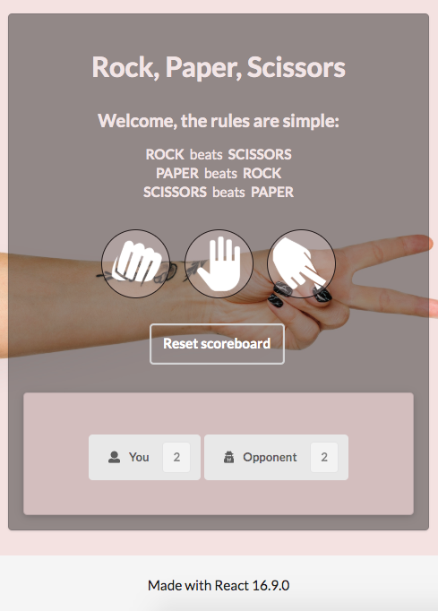

# Rock, Paper, Scissors 
### Author  
[Clarissa Liljander](https://github.com/clalil) 
## Built with  
**Front End:** React v.16.9.0, CSS  
**Back End:** N/a  
**Testing frameworks:** Cypress, Enzyme  



## The code   
This repository contains my individual RPS Game challenge from the Craft Academy Boot Camp. We were allowed to choose for ourselves which testing frameworks and libraries to use during this challenge and received no coach support. I chose to take on this challenge with very little previous knowledge of React before creating this app, as well as no previous experience of the testing frameworks or sinon.   
## Getting started
### Dependencies  
* Create React App    
* Enzyme
* Cypress 
* Sinon

### Setup   
To test this application you need to fork it to your own GitHub account and clone it to your local workspace.  

To run the unit tests:  
```
$ yarn test
```  
To start cypress and run the feature tests:  
```
$ yarn cypress:open
```
To start the application:
```
$ yarn start
```

### Game rules
When you run the app, you will be presented with the rules of the game. Click on the appropriate icon to pick your choice of weapon and the game will automatically return the computer's choice and declare a winner. The results are timed and will disappear within four seconds.

The scoreboard is reset manually by clicking the __reset button__.

## Updates/Improvements  
When time given, I plan to separate my business logic from the Game component.  

## License  
This project is under the [MIT-license](https://en.wikipedia.org/wiki/MIT_License).

### Acknowledgement  
- Thank you [Craft Academy](https://craftacademy.se) for giving me this assignment.  
- The icons are from [Game-icons.net](https://game-icons.net).
- The background image is from [Pexels](https://www.pexels.com).
- How to stub a random game functionality was found at [Stack Owerflow](https://stackoverflow.com/questions/10515000/how-to-test-with-math-random-in-javascript/10516416).
- The tests using Jest, in the first commits of the development branch, are from [Learn TDD in React](https://learntdd.in/react/). The only purpose of these was to learn how to test components in React before moving forward with my own app. 

## User Stories  
```
As a User  
In order to play the Rock, Paper, Scissors game    
I want to be able to choose a weapon     

As a User  
When I play the game    
I want to play against a computer   

As a User  
When I play against the computer   
I want to know which one of us won the game  

As a User  
In order to fully enjoy this game    
I wish to keep track of my wins and losses  
```